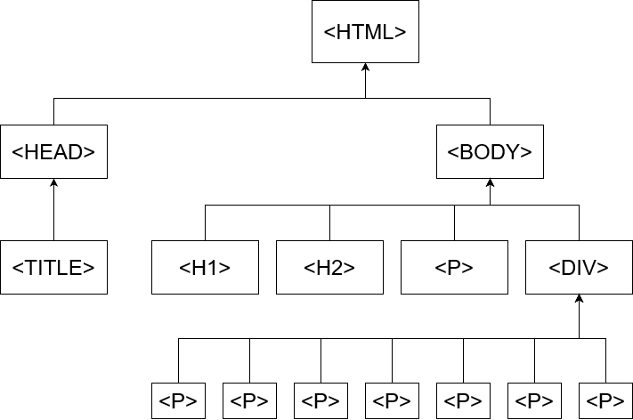

# Les1

Oefening 1 is het opzoeken van de verschillende tags. Ik hoop dat je dat wel kan?

## Oefening 2

```html
<html>
    <head>
        <title>Oefening 2</title>
    </head>
      
        <body>
            <header></header>
        <!--1a-->
        <div>
            <h1>Dit is de hoofdtitel</h1>
            <h5>Me non paenitet nullum festiviorem excogitasse ad hoc.</h5>
        </div>

        <div>
            <h2>Dit is de ondertitel</h2>
            <h5>Etiam habebis sem dicantur magna mollis euismod.</h5>
        </div>

        <!--1b-->
        <div>
            <h1>Hoofding 1</h1>
            <h2>Hoofding 2</h2>
            <h3>Hoofding 3</h2>

            <h4>Hoofding 4</h4>
            <h5>Hoofding 5</h5>
            <h6>Hoofding 6</h6>
        </div>

        <!--1c-->
        <div>
            <h2>HTML-links</h2>
            <h5>HTML-links worden gedefinieerd door een tag te gebruiken.</h5>
            <a href="https://www.ap.be/">Dit is een link naar de website van de AP-hogeschool</a>
        </div>

        <!--1d-->
        <div>
            <h2>HTML afbeeldingen</h2>
            <h5>HTML afbeeldingen worden gedefinieerd door een tag te gebruiken.</h5>
            
        </div>

        <!--1e-->
        <div>
            <h2>HTML afbeeldingen met een link</h2>
            <h5>HTML-afbeeldingen en links worden gedefinieerd door tags te gebruiken.</h5>
            <a href="https://www.ap.be/"></a>
        </div>
    
        <footer></footer>
      </body>
</html>
```

## Oefening 3



## Oefening 4

```html
<!DOCTYPE html>
<html>
    <head>
    <title>Mijn webpagina met header, main en footer</title>
    <nav>
        <a href="#">Home</a>
        <a href="#">Contact</a>
      </nav>
    </head>
	<body>
        <header>
            <h1>Web Technology</h1>
        </header>

        <main>
            <div>
                Hier staat over je hobby/sport 
            </div><br>
             <!--Dit is een afbeelding naar keuze over je sport-->
        </main>

        <footer>
            Hassan Haddouchi
        </footer>
    </body>
</html>
```
## Oefening 5 - Boodschappenlijstje

```html
<!DOCTYPE html>
<html>
	<head>
    <title>Oefening 5</title>
    </head>
  
	<body>
        <header>
            <h3>Mijn boodschappenlijst</h3>
        </header>

        <main>

            <ul>
                <li>Thee</li>
                <li>Melk</li>
                <li>Bananen: <a href="https://www.delhaize.be/nl-be/shop/Verse-groenten-en-fruit/Vers-Fruit/Bananen/Bananen-Fairtrade-Bio-Eco-Cat1/p/F2019012300029640000">link naar de bananen</a></li>
                <li>Tomaten: <a href="https://www.colruyt.be/nl/producten/tomaten-extra-29800">link naar de tomaten</a></li>
            </ul>

        </main>
  </body>
</html>
```
[Terug](../Vakken/Web-technology.md)
